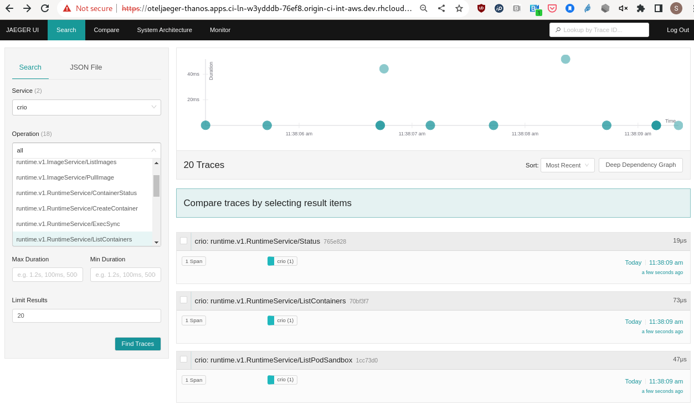

## Observability in MicroShift

This repository is a collection of manifests to enable observability in MicroShift. To get started, follow this README to deploy a VM and MicroShift.
Then, view the following observability scenarios:

1. [Kubernetes Metrics Server](manifests/metrics-server/README.md)
5. [Send Telemetry to OpenShift Cluster](manifests/openshift-observability-hub/README.md)
2. [OpenTelemetry Collector Operator & Collector](manifests/opentelemetry-collector-operator/README.md)
3. [MicroShift Kepler Deployment with OpenShift Monitoring Stack](manifests/sample-instrumented-applications/kepler/README.md)
2. [Performance CoPilot in RHEL Device Edge](./manifests/edge-pcp-to-ocp/README.md)
3. [Sample Application with Traces](manifests/sample-instrumented-applications/sample-tracing-app/README.md)
4. [Jaeger Deployment](manifests/jaeger/jaeger.md)
5. [Grafana Agent](manifests/grafana-agent/README.md)
2. [OpenTelemetry Collector No Operator](manifests/otel-collector/README.md)
2. [Create Amazon Machine Image for RHEL Device Edge OS](ami/README.md)

### CPU/Memory from kube-metrics-server

`kubectl top pods -A`


### Screenshots

Data sent from local MicroShift virtual machine to OpenShift grafana


Prometheus metrics from MicroShift virtual machine 


Jaeger UI from OpenShift showing traces from MicroShift VM




### MicroShift deployment in KVM

Follow the Microshift documentation for bootstrapping a MicroShift instance running in a RHEL 8.7 Virtual Machine. Complete all prerequisites.
[Red Hat Enterprise Linux 8.7 virtual machine Getting Started with MicroShift](https://github.com/openshift/microshift/blob/main/docs/getting_started.md)

### Bootstrap MicroShift

[Bootstrap command from MicroShift documentation](https://raw.githubusercontent.com/openshift/microshift/main/docs/getting_started.md)

This command creates a `microshift-starter` virtual machine with 4 CPU cores, 6GB RAM and 50GB storage.

```bash
VMNAME=microshift-starter
DVDISO=/var/lib/libvirt/images/rhel-8.7-x86_64-dvd.iso
KICKSTART=https://raw.githubusercontent.com/openshift/microshift/main/docs/config/microshift-starter.ks

sudo -b bash -c " \
cd /var/lib/libvirt/images && \
virt-install \
    --name ${VMNAME} \
    --vcpus 4 \
    --memory 6144 \
    --disk path=./${VMNAME}.qcow2,size=50 \
    --network network=default,model=virtio \
    --events on_reboot=restart \
    --location ${DVDISO} \
    --extra-args \"inst.ks=${KICKSTART}\" \
"
```

To configure the machine, follow the below steps.
Use the IP address and `redhat:redhat` to access the virtual machine.
First, scp the pull-secret (follow above documentation) and the configure script over to the VM.
Then, ssh into the virtual machine and run the configure script. This script configures RH subscription manager
and places the pull-secret where CRI-O expects it at `/etc/crio/openshift-pull-secret` 

```bash
sudo virsh domifaddr microshift-starter # note the IP address 
export IP_ADDR=<ip address from above>
# password is 'redhat' for below cmds
scp ./configure-microshift-vm.sh  redhat@${IPADDR}:
scp ~/.pull-secret.json redhat@${IPADDR}:
ssh redhat@${IPADDR}
```

### Execute below commands from within the virtual machine

```bash
./configure-microshift-vm.sh ~/.pull-secret.json
# script will ask for your RH account creds for subscription
```

#### Start MicroShift service

```bash
sudo systemctl enable --now microshift
mkdir ~/.kube
sudo cp /var/lib/microshift/resources/kubeadmin/kubeconfig ~/.kube/config
sudo chown -R redhat:redhat ~/.kube
oc get pods -A # all pods should soon be running
```
