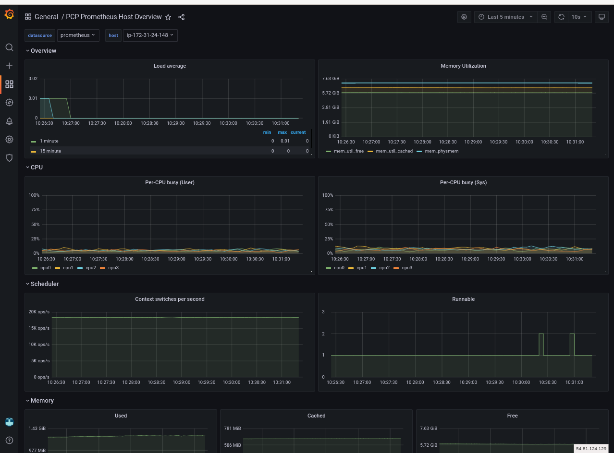

## Send PCP metrics from RHEL machine to OpenShift

Performance Co-Pilot (PCP) data from any RHEL system can be directed to OpenShift (OCP) eliminating the need for prometheus at the edge.
Metrics are sent from OpenTelemetry Collector running in a podman container using the `prometheusremotewrite` exporter to `thanos receiver` in the OCP cluster.

### Hub OpenShift cluster

Deploy Thanos receiver outlined below.

#### Deploy Thanos Receive

Refer to [federated prometheus blog](https://cloud.redhat.com/blog/federated-prometheus-with-thanos-receive)
and also [thanos-receive OpenShift demo](https://github.com/rhthsa/openshift-demo/blob/main/thanos-receive.md)

For this example, thanos-store-gateway is not deployed. Refer to the blogs above to configure thanos storage for HA.

```bash
cd thanos-receiver
oc create ns thanos
oc apply -f thanos-scc.yaml

# If adding thanos-store-gateway run below command
#oc -n thanos create secret generic store-s3-credentials --from-file=store-s3-secret.yaml
#oc -n thanos create thanos-store-gateway-sa.yaml
#oc -n thanos adm policy add-scc-to-user anyuid -z thanos-store-gateway

# create thanos-receive, edge, and thanos-querier serviceaccounts and policies
oc -n thanos create -f sa.yaml
oc -n thanos adm policy add-cluster-role-to-user system:auth-delegator -z thanos-receive
oc -n thanos annotate serviceaccount thanos-receive serviceaccounts.openshift.io/oauth-redirectreference.thanos-receive='{"kind":"OAuthRedirectReference","apiVersion":"v1","reference":{"kind":"Route","name":"thanos-receive"}}'
oc -n thanos annotate serviceaccount thanos-querier serviceaccounts.openshift.io/oauth-redirectreference.thanos-querier='{"kind":"OAuthRedirectReference","apiVersion":"v1","reference":{"kind":"Route","name":"thanos-querier"}}'

# create serviceaccount tokens
oc -n thanos create -f thanos-sa-token-secrets.yaml 

# If adding thanos-store-gateway run below commands
# create thanos store gateway
# oc -n thanos create -f store-gateway.yaml
# oc -n thanos get pods -l "app=thanos-store-gateway"

# create thanos receiver
oc -n thanos create secret generic thanos-receive-proxy --from-literal=session_secret=$(head /dev/urandom | tr -dc A-Za-z0-9 | head -c43)
oc -n thanos apply -f thanos-receive.yaml
oc -n thanos create route reencrypt thanos-receive --service=thanos-receive --port=web-proxy --insecure-policy=Redirect

# create thanos querier
oc -n thanos create secret generic thanos-querier-proxy --from-literal=session_secret=$(head /dev/urandom | tr -dc A-Za-z0-9 | head -c43)
oc -n thanos create -f thanos-querier-thanos-receive.yaml
oc -n thanos create route reencrypt thanos-querier --service=thanos-querier --port=web-proxy --insecure-policy=Redirect

# scp thanos-receive serviceaccount token to RHEL machine
oc -n thanos create token thanos-receive --duration 999999h > edge-token
scp edge-token user@<RHEL_MACHINE>:

```

#### Find Thanos Receive URL, scp to RHEL machine for prometheusremotewrite exporter

```
oc -n thanos get route thanos-receive -o jsonpath='{.status.ingress[*].host}' > thanos-receive-url
scp thanos-receive-url user@<RHEL_VM>:
```
#### Extract root CA and SCP to RHEL machine

```bash
oc extract cm/kube-root-ca.crt -n openshift-config
scp ca.crt  user@<RHEL_VM>:
```

### RHEL machine

#### Configure Authentication for Thanos Receive

**scp'd files are at $HOME/.**

#### Update OpenTelemetry Collector config  with OCP URLs, tokens

```bash
wget https://raw.githubusercontent.com/sallyom/microshift-observability/main/manifests/edge-pcp-to-ocp/otelcol-config.yaml
```

Now copy contents of `thanos-receive-url` to [otelcol-config.yaml](./otelcol-config.yaml) Line #24

#### Run OpenTelemetry Collector with podman

```bash
# Note the ca.crt & edge-token are assumed to exist at $(pwd)/.

sudo podman run --rm -d --name otelcol-host \
  --security-opt label=disable  \
  --user=0 \
  --cap-add SYS_ADMIN \
  --tmpfs /tmp --tmpfs /run \
  -v /var/log/:/var/log 
  -v /sys/fs/cgroup:/sys/fs/cgroup:ro \
  -v $(pwd)/ca.crt:/conf/ca.crt:z \
  -v $(pwd)/edge-token:/conf/edge-token:z \
  -v $(pwd)/otelcol-config.yaml:/etc/otelcol-contrib/config.yaml:z\
  -v $(pwd)/otc:/otc:z  \
  --net=host \
  quay.io/sallyom/ubi8-otelcolcontrib:latest --config=file:/etc/otelcol-contrib/config.yaml
```

#### Deploy Grafana and the Prometheus DataSource with PCP Prometheus Host Overview Dashboard

You can query metrics from your application in OpenShift, `-n thanos` with the `thanos-querier route`.
However, you might prefer to view the prometheus metrics in Grafana.

Run this against the **OpenShift hub cluster**

```bash
cd microshift-observability/manifests/edge-pcp-to-ocp/thanos-receiver/dashboard-pcp-prometheus
./deploy-grafana.sh
```

You should now be able to access Grafana with `username: rhel` and `password:rhel` from the grafana route.

* Navigate to Dashboards -> to find the PCP Prometheus Host Overview dashboard.
* Navigate to Explore -> to find the Prometheus data source to query metrics from.

Here is a screenshot of PCP Prometheus Host Overview Grafana dashboard


